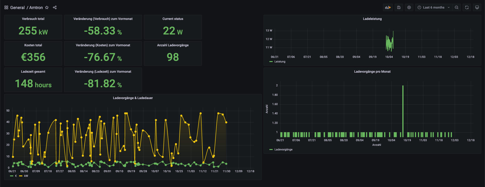

# amtron-influxdb-adapter
MENNEKES AMTRON® inoffical python adapter to write charging data to influxdb for better monitor&overview with grafana and integrate in smart home.
Use at your own risk.

## requirements
1. raspberry pi with raspbian or other server
2. influxdb
3. docker
4. available amtron in network
5. optional: nginx for proxy_pass amtron (config in nginx/amtron)

## HowTo
- `pipenv install`
- Create .env file in core/ from core/.env-example
- Create crontabs to run docker container on specific times.
  - Charging data from last 6 hours, running every 6 hours

    `0 */6 * * * docker run --rm --env-file path_to_env/.env dbitzer/amtron-influxdb-adapter:1.0 python amtron.py >/dev/null 2>&1`
  - Current charging power every minute

    `* * * * * docker run --rm --env-file path_to_env/.env dbitzer/amtron-influxdb-adapter:1.0 python amtron_power.py >/dev/null 2>&1`

## Postman collection
(POST requests missing)
- Import postman/amtron_postman.json in postman.
- Create environment with `PIN1`, `PIN2`,`AMTRON_IP` keys
- Activate environment

[Amtron devices](https://www.chargeupyourday.de/ps/amtron/)

[Thanks to lephisto](https://github.com/lephisto/amtron)